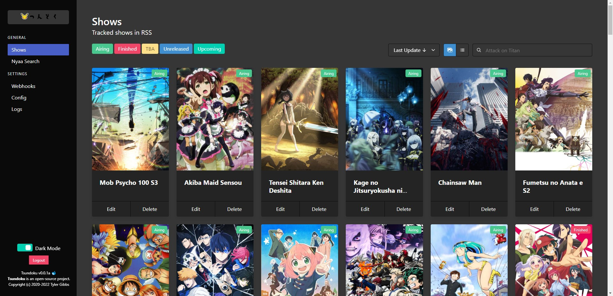

# Tsundoku (積ん読)

[](https://opensource.org/licenses/MPL-2.0)
[](https://discord.gg/thxN858gXm)

Tsundoku is an all-in-one utility to download, rename, and move anime from RSS feeds.
Anime is able to be matched from any source with an RSS feed. Out of the box, Tsundoku has sources for
[Nyaa.si](https://nyaa.si/), [SubsPlease](https://subsplease.org/), and [Tokyo Toshokan](https://www.tokyotosho.info/).

Please check out the [wiki](https://github.com/tylergibbs2/Tsundoku/wiki) if you have any troubles.

[Chat on Discord](https://discord.gg/thxN858gXm)

<p align="center">
  
</p>

## Key Features

- Parse various RSS feeds for the latest anime
- Rename and move downloaded files automatically
- Search Nyaa for existing releases and batches
- Import third-party RSS parsers to search other feeds
- Send updates to Discord or Slack with webhooks
- View airing status of shows
- Full-fledged backend RESTful API for easy integration

## Supported Download Clients

- [Deluge](https://deluge-torrent.org/) with [WebAPI Plugin](https://github.com/idlesign/deluge-webapi)
- [qBittorrent](https://www.qbittorrent.org/) with WebUI enabled
- [Transmission](https://transmissionbt.com/)

## Docker Installation (Recommended)

1. Copy the [`docker-compose.yml`](docker-compose.yml) file from the repository.
2. Replace the file paths.
3. Run `docker compose up -d`.

Updating is as simple as running `docker compose pull` and `docker compose up -d`.

## Source Installation

### Requirements

If you downloaded Tsundoku from the releases page, Yarn is not required.

- Python 3.8+
- Yarn

### Initial Setup

The cross-platform installation script should work on Windows, Linux, and macOS.
It will create a virtual environment, install dependencies, and create a `run.py` file.

```bash
$ git clone https://github.com/tylergibbs2/Tsundoku
$ cd Tsundoku
$ python install.py
```

### Updating

The installation script will also update Tsundoku and its dependencies.

```bash
$ git pull
$ python install.py
```

### Running

```bash
$ python run.py
```

_Note: `run.py` will only exist after running `install.py`._
